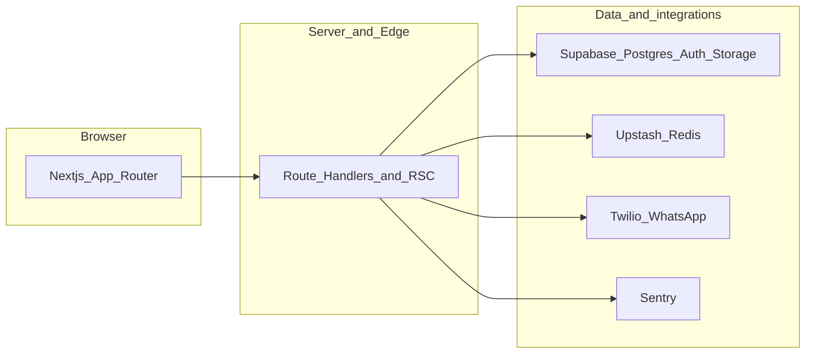

<div align="center">
  
</div>

# UrbanSaudi Real Estate Platform

A production-ready real estate platform for Saudi Arabia built with Next.js 14, Supabase, and Twilio WhatsApp integration.

## Homepage and marketplaces

The public homepage uses a gradient hero for **TheUrbanRealEstateSaudi**, navigation to **Property** (rentals), **Product** (resale marketplace), and **Maintenance** (services marketplace), partner login entry points, and a stats strip. Sliders showcase featured listings across those surfaces.

Optional marketing media belongs under [`docs/screenshots/`](docs/screenshots/README.md). Add a compressed **`homepage-demo.gif`** there when you have a screen recording that walks the homepage, marketplaces, and login affordances (avoid very large binaries in git; host externally if needed). **Admin and agent dashboard screenshots** are not generated by automation in this repo; add those files manually when ready.

## Architecture (high level)



## Product leads and WhatsApp

On a product detail page, **Contact on WhatsApp** collects the customer name and phone, creates a **buy request** for admins and the listing seller (in-app notifications), and redirects the browser to **WhatsApp** (`wa.me`) with a prefilled message to the seller phone on file. **Seller** and **maintenance** agent applications require a WhatsApp number at signup; **property** and **visiting** programs still collect an optional company name.

## ✨ Features

### For Customers
- 🏠 Browse properties for sale/rent with advanced filters
- 🛋️ Product marketplace with **Contact on WhatsApp** (lead saved for admin + seller, then opens WhatsApp on the customer device)
- 📅 Schedule property visits with real-time slot availability
- 💬 WhatsApp notifications for visit confirmations
- 🔔 Real-time in-app notifications
- 📱 Fully responsive mobile design

### For Agents
- 📝 Complete property & product CRUD operations
- 🖼️ Multi-image upload with Supabase Storage
- 📊 Dashboard with visit & lead management
- 📈 Analytics on property views and engagement
- ⏱️ Real-time updates on slot bookings
- ✅ Approval workflow with admin review

### For Administrators
- 👥 Agent approval/rejection system
- ✔️ Visit & buy request confirmation workflows
- 📜 Comprehensive audit logging
- 💬 Automated WhatsApp notifications to customers
- 📊 Platform-wide statistics and metrics
- 🔍 Advanced filtering and search capabilities

## 🛠️ Tech Stack

- **Framework**: Next.js 14.2.35 (App Router, React Server Components)
- **Database**: Supabase (PostgreSQL + Row Level Security)
- **Auth**: Supabase Auth (email/password, role-based access)
- **Storage**: Supabase Storage (images, documents)
- **Cache**: Redis via Upstash (cache-aside pattern, 60s TTL)
- **Realtime**: Supabase Realtime (slot updates, notifications)
- **Notifications**: Twilio WhatsApp Business API
- **State**: Zustand (client state) + TanStack Query (server state)
- **Styling**: Tailwind CSS + shadcn/ui components
- **Forms**: React Hook Form + Zod validation
- **Monitoring**: Sentry (optional error tracking)
- **E2E**: Playwright specs under `tests/` (run with `npx playwright test` after `npx playwright install chromium`)

## 📁 Project Structure

```
urbansaudi/
├── src/
│   ├── app/
│   │   ├── (auth)/              # Authentication pages
│   │   │   ├── login/
│   │   │   ├── signup/
│   │   │   ├── callback/
│   │   │   └── pending-approval/
│   │   ├── (dashboard)/         # Protected dashboards
│   │   │   ├── admin/           # Admin panel
│   │   │   └── agent/           # Agent panel
│   │   ├── (public)/            # Public pages
│   │   │   ├── properties/
│   │   │   └── products/
│   │   └── api/                 # API routes
│   │       ├── admin/
│   │       ├── agent/
│   │       ├── visits/
│   │       ├── leads/
│   │       └── whatsapp/
│   ├── components/
│   │   ├── ui/                  # shadcn/ui components
│   │   ├── layout/              # Sidebar, navigation
│   │   ├── property/            # Property-specific components
│   │   ├── product/             # Product-specific components
│   │   ├── visit/               # Visit scheduler
│   │   ├── dashboard/           # Dashboard widgets
│   │   └── shared/              # Reusable components
│   ├── lib/
│   │   ├── supabase/            # Supabase clients (server, client, admin)
│   │   ├── redis.ts             # Redis caching utilities
│   │   ├── twilio.ts            # Twilio WhatsApp client
│   │   ├── validators.ts        # Zod schemas
│   │   └── utils.ts             # Helper functions
│   ├── hooks/
│   │   ├── use-auth.ts          # Authentication hook
│   │   ├── use-realtime.ts      # Generic realtime hook
│   │   └── use-toast.ts         # Toast notifications
│   ├── stores/
│   │   ├── auth-store.ts        # Zustand auth state
│   │   └── notification-store.ts
│   ├── queries/                 # TanStack Query hooks
│   ├── types/                   # TypeScript definitions
│   └── config/                  # App configuration
├── supabase/
│   └── migrations/
│       └── 00001_initial_schema.sql
├── DEPLOYMENT.md                # Comprehensive deployment guide
└── .env.example                 # Environment variables template (copy to .env.local)
```

## 🚀 Quick Start

### 1. Clone Repository
```bash
git clone https://github.com/salmanjoyiaa/urbanmobile.git
cd urbanmobile
```

### 2. Install Dependencies
```bash
npm install
```

### 3. Set Up Environment Variables
```bash
cp .env.example .env.local
```

Fill in required variables (see `.env.example` for details):
- Supabase credentials (URL, anon key, service role key)
- Upstash Redis (optional, for caching)
- Twilio WhatsApp (optional, for notifications)

### 4. Run Database Migration
1. Create Supabase project at [supabase.com](https://supabase.com)
2. Copy SQL from `supabase/migrations/00001_initial_schema.sql`
3. Paste into Supabase SQL Editor → Run
4. Verify 8 tables created

See [DEPLOYMENT.md](DEPLOYMENT.md) for database and Supabase setup.

### 5. Start Development Server
```bash
npm run dev
```

Visit `http://localhost:3000`

## 📝 Environment Variables

Required:
- `NEXT_PUBLIC_SUPABASE_URL` - Your Supabase project URL
- `NEXT_PUBLIC_SUPABASE_ANON_KEY` - Supabase anon/public key
- `SUPABASE_SERVICE_ROLE_KEY` - Supabase service role key (server-side only)
- `NEXT_PUBLIC_SITE_URL` - Your site URL (e.g., `https://urbansaudi.com`)

Optional (for full functionality):
- `UPSTASH_REDIS_REST_URL` - Upstash Redis URL (caching)
- `UPSTASH_REDIS_REST_TOKEN` - Upstash Redis token
- `TWILIO_ACCOUNT_SID` - Twilio account SID (WhatsApp)
- `TWILIO_AUTH_TOKEN` - Twilio auth token
- `TWILIO_WHATSAPP_FROM` - Twilio WhatsApp number (e.g., `whatsapp:+14155238886`)
- `ADMIN_WHATSAPP_NUMBER` - Admin number for agent signup alerts
- `NEXT_PUBLIC_SENTRY_DSN` - Sentry DSN (error monitoring)

## 🌐 Deployment

### Vercel (Recommended)

1. **Push to GitHub**
   ```bash
   git add .
   git commit -m "Ready for deployment"
   git push origin main
   ```

2. **Import to Vercel**
   - Go to [vercel.com](https://vercel.com) → New Project
   - Import from GitHub
   - **Environment variables:** Set all variables from [.env.example](.env.example) in the Vercel project dashboard (**Settings → Environment Variables**). Use placeholder values as a reference; fill with your real Supabase, Upstash, and Twilio values. Required for build: `NEXT_PUBLIC_SUPABASE_URL`, `NEXT_PUBLIC_SUPABASE_ANON_KEY`, `SUPABASE_SERVICE_ROLE_KEY`, `NEXT_PUBLIC_SITE_URL`, `NEXT_PUBLIC_SITE_NAME`.
   - Set `NEXT_PUBLIC_SITE_URL` to your Vercel deployment URL (e.g. `https://your-app.vercel.app`) or custom domain for production.
   - Deploy

3. **Post-Deployment**
   - Add your Vercel URL to **Supabase** → Authentication → URL Configuration (Redirect URLs and Site URL).
   - Set **Twilio** webhook URL to `https://your-vercel-domain.vercel.app/api/whatsapp/webhook`.
   - Create first admin user via SQL (see [DEPLOYMENT.md](DEPLOYMENT.md)).

See [DEPLOYMENT.md](DEPLOYMENT.md) for the full step-by-step guide.

## 📚 Documentation

- **[DEPLOYMENT.md](DEPLOYMENT.md)** - Full deployment guide (Supabase, Upstash, Twilio, Vercel)
- **[.env.example](.env.example)** - List of environment variables; copy to `.env.local` locally, or set in Vercel dashboard for deployment

## 🔐 Security Features

- ✅ Row Level Security (RLS) on all Supabase tables
- ✅ Server-side authentication validation on all API routes
- ✅ Agent ID derivation server-side (never from client input)
- ✅ Rate limiting (3 requests/hour on visit/lead endpoints)
- ✅ HTTPS enforced (Vercel default)
- ✅ CSP headers configured
- ✅ Twilio webhook signature validation (HMAC)
- ✅ Environment variable validation with Zod
- ✅ XSS protection via React escaping
- ✅ CSRF protection via Supabase Auth

## 📊 Key Features Implementation

### Real-time Slot Updates
- Uses Supabase Realtime subscriptions on `visit_requests` table
- Invalidates TanStack Query cache on INSERT/UPDATE/DELETE
- Cross-tab synchronization within 2 seconds
- Graceful degradation if realtime unavailable

### Redis Caching Strategy
- Cache-aside pattern with 60s TTL for property listings
- 30s TTL for visit slots with immediate invalidation on booking
- Console logging for hit/miss tracking
- Memory fallback if Redis unavailable

### WhatsApp Notifications
- Best-effort delivery via `Promise.allSettled`
- 3-retry exponential backoff on failures
- E.164 phone number validation
- Delivery status tracking via webhooks
- Audit logging for all sends

### Image Upload
- Multi-image upload to Supabase Storage
- Client-side preview before upload
- Signed URLs for private documents
- Public URLs for property/product images
- MIME type and size validation

## 🧪 Testing

### Local Testing
```bash
# Run development server
npm run dev

# Build for production
npm run build

# Start production server
npm run start

# Lint code
npm run lint
```

### End-to-end (Playwright)

```bash
npx playwright install chromium
npx playwright test
```

Point `BASE_URL` (or your env) at a running instance (`npm run dev` or staging). The product buy flow expects a redirect to `wa.me` after submitting **Contact on WhatsApp**.

### Manual Testing Checklist
- [ ] User signup → email verification → login
- [ ] Agent signup → pending approval → admin approval → WhatsApp notification
- [ ] Property creation → image upload → public visibility
- [ ] Visit scheduling → slot booking → admin confirmation → WhatsApp
- [ ] Product page → **Contact on WhatsApp** → lead in admin and seller dashboards; WhatsApp opens with prefilled text
- [ ] Notification bell realtime updates
- [ ] Redis cache hit/miss logs in Vercel

## 🐛 Troubleshooting

### Build Errors
- Ensure all environment variables are set
- Check TypeScript errors: `npm run build`
- Clear `.next` folder: `rm -rf .next`

### Authentication Issues
- Verify Supabase URL and anon key
- Check redirect URLs in Supabase dashboard
- Ensure cookies enabled in browser

### Realtime Not Working
- Enable Realtime on tables in Supabase dashboard
- Check browser console for connection errors
- Verify RLS policies allow SELECT on realtime tables

### WhatsApp Not Sending
- Check Twilio credentials in environment variables
- Verify phone numbers in E.164 format: `+966XXXXXXXXX`
- Check Twilio Console → Monitor → Logs for errors
- For sandbox, ensure recipient has joined sandbox

## 📈 Performance

- **First Load JS**: 87.3 kB shared
- **Largest Route**: 198 kB (`/properties/[id]`)
- **Build Time**: ~30 seconds
- **Static Routes**: 6/33 (prerendered at build)
- **Dynamic Routes**: 27/33 (server-rendered on demand)
- **Cache Hit Rate**: ~70% on property listings (with Redis)

## 🤝 Contributing

This is a production codebase. For modifications:
1. Create feature branch
2. Test locally (`npm run build` must pass)
3. Update documentation if needed
4. Submit pull request with detailed description

## 📄 License

Private project. All rights reserved.

## 🆘 Support

For deployment or technical issues:
1. Check [DEPLOYMENT.md](DEPLOYMENT.md) troubleshooting section
2. Review Vercel Function logs
3. Check Supabase Dashboard logs
4. Verify environment variables

## 🎯 Roadmap

- [ ] Email notifications (in addition to WhatsApp)
- [ ] Payment integration for property bookings
- [ ] Agent subscription tiers
- [ ] Advanced analytics dashboard
- [ ] Mobile app (React Native)
- [ ] Multi-language support (Arabic/English)
- [ ] Google Maps integration (replace Leaflet placeholder)

---

**Built with ❤️ for the Saudi Arabian real estate market**

- **Repository**: https://github.com/salmanjoyiaa/urbanmobile
- **Live Demo**: https://urbanmobile.vercel.app (pending deployment)
- **Last Updated**: May 2026


## Deploy on Vercel

The easiest way to deploy your Next.js app is to use the [Vercel Platform](https://vercel.com/new?utm_medium=default-template&filter=next.js&utm_source=create-next-app&utm_campaign=create-next-app-readme) from the creators of Next.js.

Check out our [Next.js deployment documentation](https://nextjs.org/docs/app/building-your-application/deploying) for more details.
